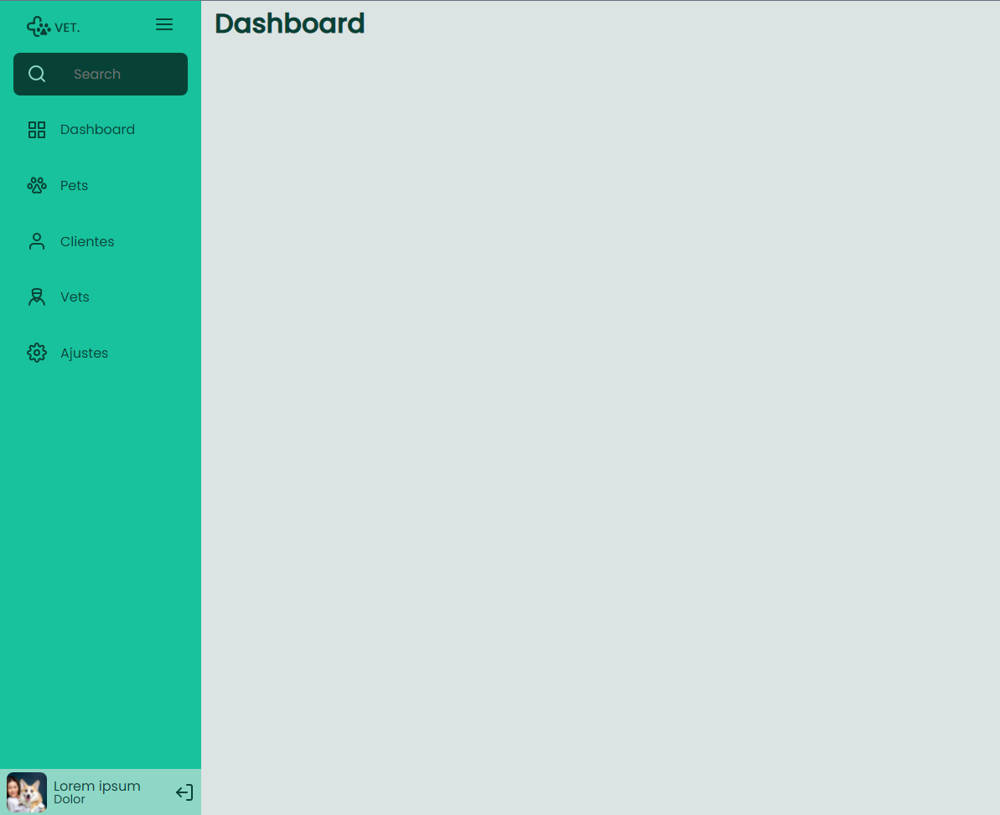

# Sidebar

  

##

### 🛠 Tecnologias
Foram usadas as tecnologias:

  - *HTML*
  - *CSS*
  - *JavaScript*

##

### 💻 Projeto
Neste desafio foi criado uma sidebar responsiva. Quando o usuário clicar no ícone do menu isso deve fazer com que o estado da sidebar mude entre "aberto", mostrando ícones e texto e "fechado", mostrando apenas os ícones. Utilizando HTML, CSS e Javascript.

Figma: https://bit.ly/3sdH1XB

#### Features:
<!-- ❌✅ -->

1. ✅ Criar uma sidebar que que altere o estado entre aberto e fechado conforme o clique do usuário.
2. ✅ Adicionado um campo de pesquisa em texto.

##

### 🚀 Deploy
https://rafaeljurkfitz.github.io/sidebar/
